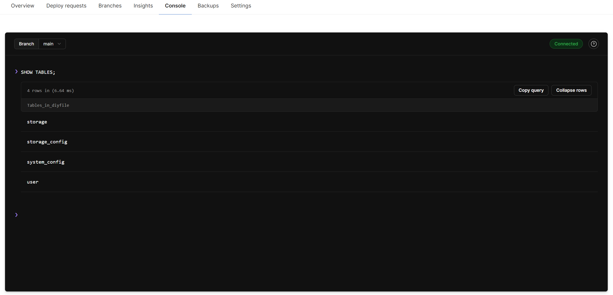

::: warning 注意
此功能将在 v0.2.2 版本中上线，目前尚未合并进主分支！
:::

## 数据库

### planetscale 方案

[planetscale](https://planetscale.com/) 有一个免费额度的数据库，这个平台功能还很强大，详细的内容可以看看官网介绍。

免费额度的数据库有以下限制：
- 5 GB 存储空间
- 10 亿行读取/月
- 1000 万行写入/月

拿来简单用用戳戳有余了。

* 创建数据库

来到控制台，我们点击按钮下的 `create` 创建数据库 `ditfile`。

然后区域选择一个你喜欢的，或者离你近的，然后点击 `create database`，慢慢等待初始化就行了。

* 导入表结构和数据

点击 `Console` 标签下的 `Connect`，进入数据库控制台。然后下载 [Release](https://github.com/besscroft/diyfile/releases) 页面的最新版本的数据库文件。
或者是项目仓库 `main` 分支下的 `doc/sql/` 目录下的 `diyfile-meta.sql` 和 `diyfile-data.sql` 文件。
用文本编辑的形式打开，依次复制里面的内容，粘贴到数据库控制台的输入框中，然后回车执行，或者是直接连接数据库后导入，网页控制台可能会限制某些语句。

* 连接数据库

点击 Overview 标签下的 `Connect`，进入数据库连接信息页面。

可以查看到你的连接信息，图中红框框内的内容，就是数据库地址，对应的是 Docker 启动时的 `DB_URL` 环境变量。

导入后在控制台看到的应该是这样的。你可以输入 `SHOW TABLES;` 查看，不过注意这个分号，我在使用时复制进去的不行，非得手动输入，不然就报语法错误了。。。
