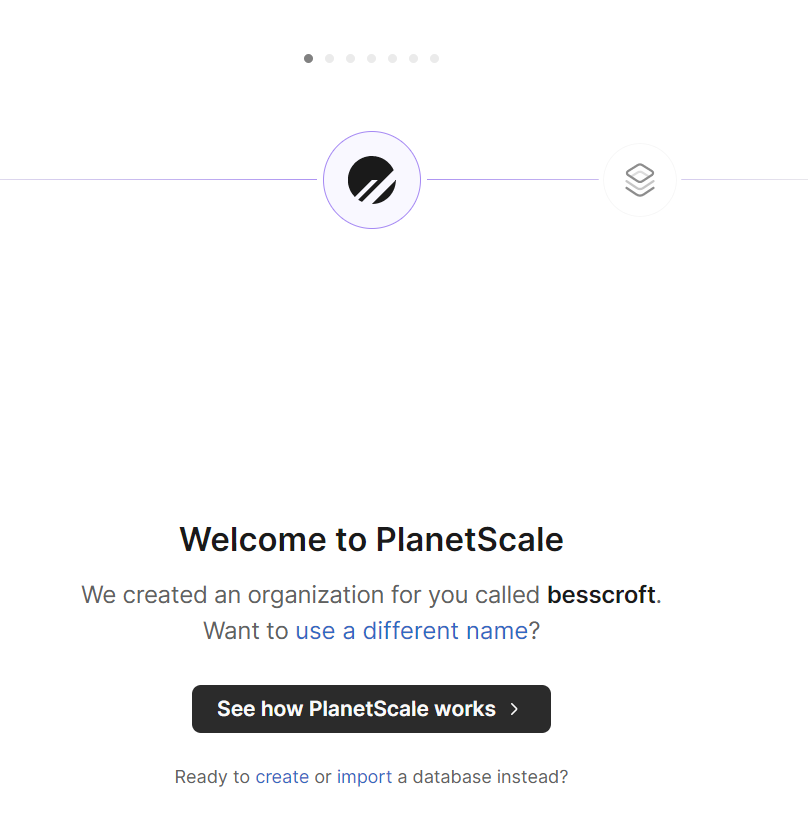
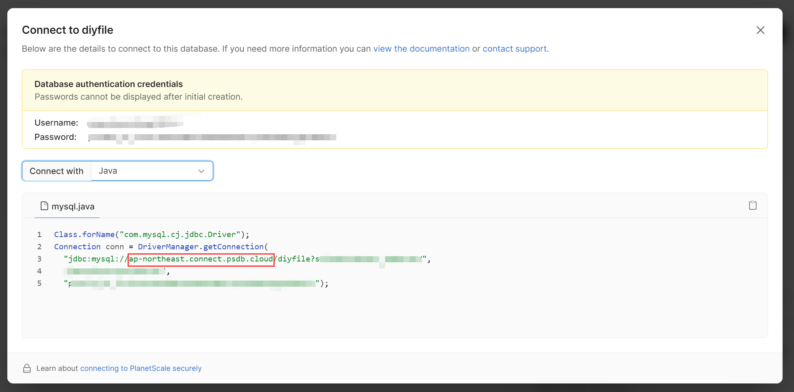

::: warning Notice
There are many databases that support free quota, such as [Amazon DynamoDB](https://aws.amazon.com/cn/dynamodb/), but I don't recommend it.
Because platforms with complex bills such as AWS are prone to uncontrollable expenses, which cause trouble for people. Of course, you can come here as you are familiar with!
:::

## Database Free Plan

### planetscale

[planetscale](https://planetscale.com/) has a free quota database. This platform is still very powerful. For details, please refer to the official website introduction.

The free quota database has the following restrictions：
- 5 GB of storage
- 1 billion rows read/month
- 10 million rows written/month

It is more than enough to use it simply.

* create database

Come to the console, we click `create` under the button to create the database `ditfile`.

Then choose an area you like, or one that is close to you, and then click `create database`, and wait for the initialization.

* Import table structure and data

Click on `Connect` under the `Console` tab to enter the database console. Then download the `diyfile-meta.sql` and `diyfile-data.sql` files in the `doc/sql/` directory under the `main` branch of the project warehouse.
Open it in the form of text editing, copy the contents in turn, paste them into the input box of the database console, and then press Enter to execute, or directly connect to the database and import, the web console may restrict certain statements.

* Connect to the database

Click `Connect` under the Overview tab to enter the database connection information page.

You can view your connection information. The content in the red frame in the figure is the database address, which corresponds to the `DB_URL` environment variable when Docker starts.

This should look like this in the console after importing. You can enter `SHOW TABLES;` to view, but pay attention to the semicolon, I can't copy it in when I use it, I have to enter it manually, otherwise a syntax error will be reported. . .

> After finishing, pay attention to the need to open the database SSL!!!
